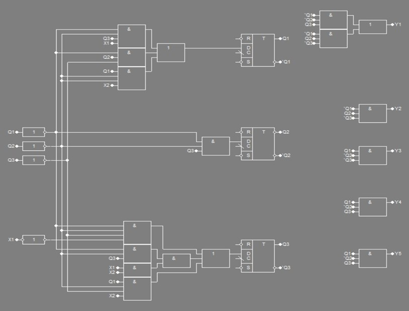

# Тема: Проектування та дослідження автомата Мура

## 📘 Теоретичні відомості

### ✳️ Абстрактний та структурний синтез автомата Мура

Абстрактний та структурний синтез автомата Мура виконується аналогічно до автомата Мілі.

Розглянемо приклад синтезу автомата Мура на D-тригерах та елементах булевого базису.

Кодування станів автомата Мура виконаємо аналогічно до [наведеного у прикладі з автоматом Мілі](https://github.com/chadowgg/-UA-Design-and-research-of-the-Milli-automaton).

## 🧪 Хід роботи

### 🔢 Вхідні дані

h₉ = 0, h₆ = 1, h₅ = 0, h₄ = 1, h₃ = 0, h₂ = 0, h₁ = 1

**Логічні умови:** x̅₁,x₂

**Послідовність керуючих сигналів:** y₁, (y₁, y₂), y₃, (y₄, y₅)

**Тип тригера:** D

**Рисунок 11.1. ГСА структурного автомата Мура**

**Рисинок 11.2. Граф автомата Мура**

Кількість тригерів, необхідних для організації пам'яті автомата, визначається із співвідношення m > ⎡log2M⎤, 
де М — число станів автомата. Кожному станові zi має відповідати одна визначена комбі¬нація значень Q₁, ..., Qₘ. 
Кількість тригерів 3, m > $\lceil \log_2{5} \rceil = 3$

📊 **Таблиця 11.1. Таблиця кодування станів автомата Мура**
| Стан | Q₁  | Q₂  | Q₃  |
|------|-----|-----|-----|
| z₁   | 0   | 0   | 1   |
| z₂   | 0   | 1   | 0   |
| z₃   | 0   | 1   | 1   |
| z₄   | 1   | 0   | 0   |
| z₅   | 1   | 0   | 1   |

### Таблиця 11.2. Структурна таблиця автомата Мура

| ПС*  | Код ПС |    |    |СП* | Код СП |      |      | Логічна умова |    | Керуючі сигнали |    |    |    |    | Функції збурення тригерів |    |    |
|------|--------|----|----|----|--------|------|------|---------------|----|-----------------|----|----|----|----|---------------------------|----|----|
|      | Q₁ˢ    | Q₂ˢ| Q₃ˢ|    | Q₁ˢ⁺¹  | Q₂ˢ⁺¹| Q₃ˢ⁺¹| x₁            | x₂ | y₁              | y₂ | y₃ | y₄ | y₅ | D₁                        | D₂ | D₃ |
| z₁   | 0      | 0  | 0  | z₂ | 0      | 0    | 1    | -             | -  | 0               | 0  | 0  | 0  | 0  | 0                         | 0  | 1  |
| z₂   | 0      | 0  | 1  | z₃ | 0      | 1    | 0    | 0             | -  | 1               | 0  | 0  | 0  | 0  | 0                         | 1  | 0  |
| z₂   | 0      | 0  | 1  | z₄ | 1      | 0    | 0    | 1             | 0  | 1               | 0  | 0  | 0  | 0  | 1                         | 0  | 0  |
| z₂   | 0      | 0  | 1  | z₅ | 1      | 0    | 1    | 1             | 1  | 1               | 0  | 0  | 0  | 0  | 1                         | 0  | 1  |
| z₃   | 0      | 1  | 0  | z₄ | 1      | 0    | 0    | -             | 0  | 1               | 1  | 1  | 0  | 0  | 1                         | 0  | 0  |
| z₃   | 0      | 1  | 0  | z₅ | 1      | 0    | 1    | -             | 1  | 1               | 1  | 0  | 0  | 0  | 1                         | 0  | 1  |
| z₄   | 1      | 0  | 0  | z₄ | 1      | 0    | 0    | -             | 0  | 0               | 0  | 1  | 0  | 0  | 1                         | 0  | 0  |
| z₄   | 1      | 0  | 0  | z₅ | 1      | 0    | 1    | -             | 1  | 0               | 0  | 1  | 0  | 0  | 1                         | 0  | 1  |
| z₅   | 1      | 0  | 1  | z₁ | 0      | 0    | 0    | -             | -  | 0               | 0  | 0  | 1  | 1  | 0                         | 0  | 0  |

> *ПС - початковий стан, СП — стан переходу

### CДНФ функції керуючих сигналів

 y₁ = Q̅₁ Q̅₂ Q₃ ∨ Q̅₁ Q̅₂ Q₃ ∨ Q̅₁ Q̅₂ Q₃ ∨ Q̅₁ Q₂ Q̅₃ ∨ Q̅₁ Q₂ Q̅₃
 y₂ = Q̅₁ Q₂ Q̅₃ ∨ Q̅₁ Q₂ Q₃
 y₃ = Q₁ Q̅₂ Q̅₃ ∨ Q₁ Q̅₂ Q₃
 y₄ = Q₁ Q̅₂ Q₃
 y₅ = Q₁ Q̅₂ Q₃

### МДНФ функції керуючих сигналів

 y₁ = Q̅₁ Q̅₂ Q₃ ∨ Q̅₁ Q₂ Q̅₃
 y₂ = Q̅₁ Q₂ Q̅₃
 y₃ = Q₁ Q̅₂ Q₃
 y₄ = Q₁ Q̅₂ Q₃
 y₅ = Q₁ Q̅₂ Q₃

### CДНФ функції збурення тригерів

 D₁ = Q̅₁ Q̅₂ Q₃ x₁ ∨ Q̅₁ Q̅₂ Q₃ x₁ x₂ ∨ Q̅₁ Q₂ Q̅₃ x₂ ∨ Q̅₁ Q₂ Q̅₃ x₁ ∨ Q₁ Q̅₂ Q̅₃ x₂ ∨ Q₁ Q̅₂ Q̅₃ x₂
 D₂ = Q̅₁ Q̅₂ Q₃
 D₃ = Q̅₁ Q̅₂ Q̅₃ x̅₁ ∨ Q̅₁ Q̅₂ Q₃ x₁ x₂ ∨ Q₁ Q̅₂ Q̅₃ x₂

### МДНФ функції збурення тригерів

 D₁ = Q̅₁ Q̅₂ Q₃ x₁ ∨ Q̅₁ Q₂ Q̅₃ ∨ Q₁ Q̅₂ Q̅₃ x₂
 D₂ = Q̅₁ Q̅₂ Q₃
 D₃ = Q̅₁ Q̅₂ Q̅₃ x̅₁ ∨ Q̅₁ Q̅₂ Q₃ x₁ x₂ ∨ Q₁ Q̅₂ Q̅₃ x₂

### Рисунок. 11.3. Функціональні схеми цифрового автомата ###

## Використане програмне забезпечення

Для побудови та аналізу комбінаційних схем та канонічних форм булевих функцій було використано програму AFDK.
