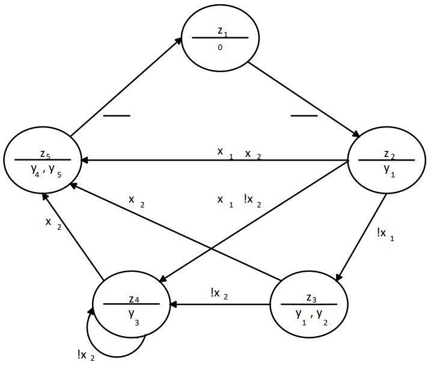

# Тема: Проектування та дослідження автомата Мура

## 📘 Теоретичні відомості

### ✳️ Абстрактний та структурний синтез автомата Мура

Абстрактний та структурний синтез автомата Мура виконується аналогічно до автомата Мілі.

Розглянемо приклад синтезу автомата Мура на D-тригерах та елементах булевого базису.

Кодування станів автомата Мура виконаємо аналогічно до [наведеного у прикладі з автоматом Мілі](https://github.com/chadowgg/-UA-Design-and-research-of-the-Milli-automaton).

## 🧪 Хід роботи

### 🔢 Вхідні дані

h₉ = 0, h₆ = 1, h₅ = 0, h₄ = 1, h₃ = 0, h₂ = 0, h₁ = 1

**Логічні умови:** x̅₁,x₂

**Послідовність керуючих сигналів:** y₁, (y₁, y₂), y₃, (y₄, y₅)

**Тип тригера:** D

**Рисунок 11.1. ГСА структурного автомата Мура**

**Рисинок 11.2. Граф автомата Мура**

Кількість тригерів, необхідних для організації пам'яті автомата, визначається із співвідношення m > ⎡log2M⎤, де М — число станів автомата. Кожному станові zi має відповідати одна визначена комбі¬нація значень Q₁, ..., Qₘ. Кількість тригерів 3, m > $\lceil \log_2{5} \rceil = 3$
